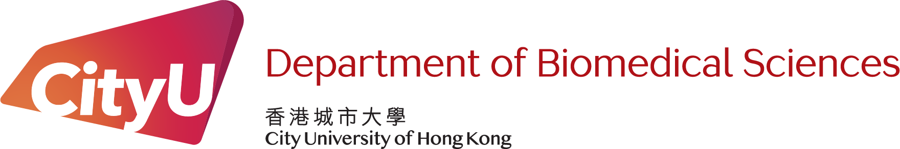
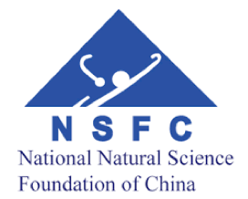

+ **Detecting Haplotype- and Clone-Specific Copy Number Aberrations in Single-Cell DNA Sequencing Data**. CityUHK Internal Grant. REG-Small Scale. PI. (01/05/26-30/04/26)

+ **Detecting the Mitochondrial Transfer in Tumor Microenviroment**. SMRF-SMART Fund (Youth Project). PI. (01/01/26-31/12/28)

+ **Structural Information Theory and Its Applications to Spatiotemporal Dynamics in Spatial Transcriptomics**. GRC-Early Career Scheme (ECS). PI. (01/09/25-31/08/27)

+ **Integrated Spatial Transcriptome Analysis and Algorithms for AI-Enabled Cancer Diagnosis**. NSFC-Young Scientist Fund (Type C). PI. (01/01/25-31/12/27)

+ **Building AI-Enabled Cancer Diagnostic Model With Ligand-Receptor Interaction Biomarkers Through Spatial Transcriptome**. CityUHK TBSC Internal Grant. PI. (01/04/24-31/03/25)

|:-:|:-:|:-:|
|  |   |   | 

|  |  | 