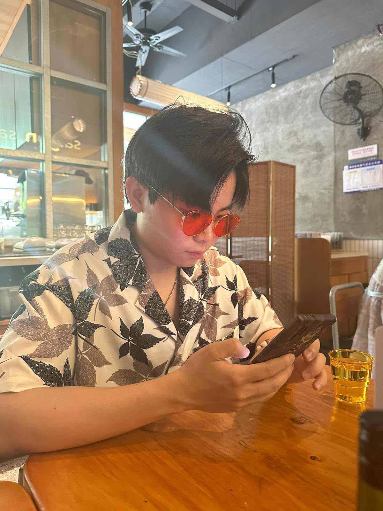

#### Ph.D. Students

<figure style="display:inline-flex; flex-direction:column; align-items:center;">
     
  <figcaption>INTJ</figcaption>
</figure>

**NG Ka Ho**, UG PMS placement (2024 - 2025). Ph.D. student in BMS (Sep 2026 - Now). 
  - **Contact**: `kahng223-c@my.cityu.edu.hk` [`CityUHK Scholar`](https://scholars.cityu.edu.hk/en/persons/ka-ho-ng-2/) 
  - **Background**: B.Sc. in Computer Science at CityUHK. 
  - **Co-Author**: NAR\*1. GB\*1.
  - **Interest**: `Deep Learning`, `Survival Modelling`, `Single-Cell/Spatial Multi-Omics`.     

<figure style="display:inline-flex; flex-direction:column; align-items:center;">
     
  <figcaption>INTP</figcaption>
</figure>

**XU Zheng**, Ph.D. student in BMS (Sep 2026 - Now). 
  - **Contact**: `zxu449-c@my.cityu.edu.hk` [`CityUHK Scholar`](https://scholars.cityu.edu.hk/en/persons/zheng-xu/) 
  - **Background**: B.Eng. in Software Engineering at NWPU.
  - **Interest**: `Deep Learning`, `Copy Number Abberation`.

<figure style="display:inline-flex; flex-direction:column; align-items:center;">
     
  <figcaption>INFJ</figcaption>
</figure>

**IP Chon Hou**, Ph.D. student in VM (Sep 2026 - Now). 
  - **Contact**: `chonhouip2-c@my.cityu.edu.hk` [`CityUHK Scholar`](https://scholars.cityu.edu.hk/en/persons/chon-hou-ip/) 
  - **Background**: B.Sc. in Immunology at UToronto. M.Sc. in Health Science and Management at CityUHK. 
  - **Interest**: `Immunology`, `Deep Learning`, `Single-Cell/Spatial Multi-Omics`.     

<figure style="display:inline-flex; flex-direction:column; align-items:center;">
     
  <figcaption>ENFP-A</figcaption>
</figure>

**LIU Yanran**, RA (April 2026 - Aug 2026), Ph.D. student in BMS (Sep 2026 - Now). 
  - **Contact**: `yanranliu7-c@my.cityu.edu.hk` [`Personal Page`](https://liuyanran666.github.io/) [`CityUHK Scholar`](https://scholars.cityu.edu.hk/en/persons/yanran-liu-2/) 
  - **Background**: B.Eng. in Financial Engineering at DLMU. M.Sc. in Information System at CityUHK. 
  - **Interest**: `Deep Learning`, `Gene Regulatory Network`, `Spatial Domains`, `Single-Cell/Spatial Multi-Omics`.     

<figure style="display:inline-flex; flex-direction:column; align-items:center;">
     
  <figcaption>INFJ-A</figcaption>
</figure>

**JIANG Anna**, RA (Aug 2024 - Aug 2025), Ph.D. student in BMS (Sep 2025 - Now). 
  - **Contact**: `anna.jiang@my.cityu.edu.hk` [`Personal Page`](https://fanjiangchenghe.github.io/) [`CityUHK Scholar`](https://scholars.cityu.edu.hk/en/persons/anna-jiang/) 
  - **Background**: B.Eng. in Computer Science at WUST. M.Sc. in Computer Science at CityUHK. 
  - **Co-1st Author**: NAR\*1. 
  - **Co-Author**: AS\*1. GB\*1.
  - **Award**: *CityUHK Research Tuition Scholarship 2025/26*. *CityUHK Outstanding Academic Performance Award 2025/26*. 
  - **Interest**: `Deep Learning`, `Single-Cell/Spatial Multi-Omics`, `Mitochondrial Transfer`, `Copy Number Abberation`

<figure style="display:inline-flex; flex-direction:column; align-items:center;">
     
  <figcaption>ESFJ-A</figcaption>
</figure>

**LYU Chengshang**, RA (June 2024 - Aug 2024), Ph.D. student in BMS (Sep 2024 - Now). 
  - **Contact**: `cs.lyu@my.cityu.edu.hk` [`Personal Page`](https://me.lvcs.top/) [`CityUHK Scholar`](https://scholars.cityu.edu.hk/en/persons/chengshang-lyu/) 
  - **Background**: B.Eng. in Information Engineering at XJTU. M.Eng. in Bioinformatics at UCAS. 
  - **1st-Author**: GB\*1. 
  - **Co-Author**: NAR\*1. eLfie\*1.
  - **Award**: *Best Poster Presentation of CityUHK BMS-SYSY BME Joint Research Gala 2025*. *CityUHK Research Tuition Scholarship 2024/25*. *BMS Postgraduate Research Output Award 2024/25*. 
  - **Interest**: `Dynamic Network Biomarker`, `Sample Specific Network`, `Gene Regulatory Network`, `Single-Cell/Spatial Multi-Omics`.

