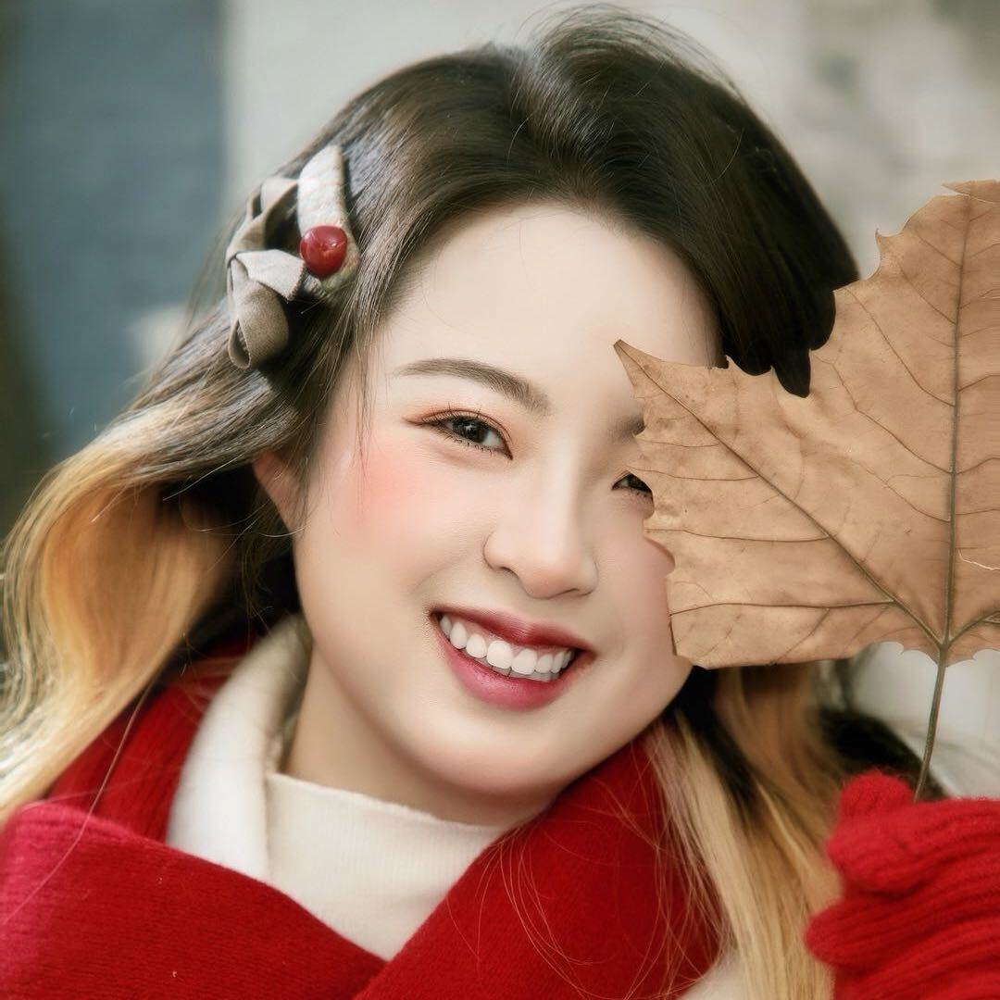
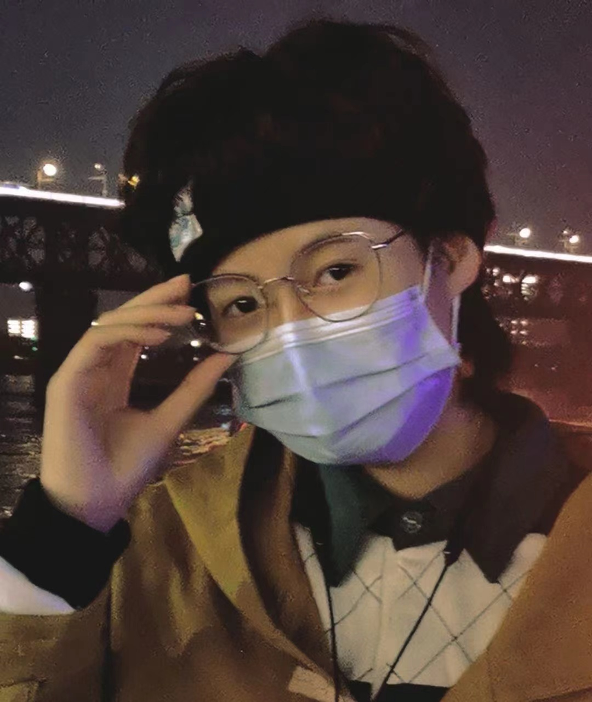
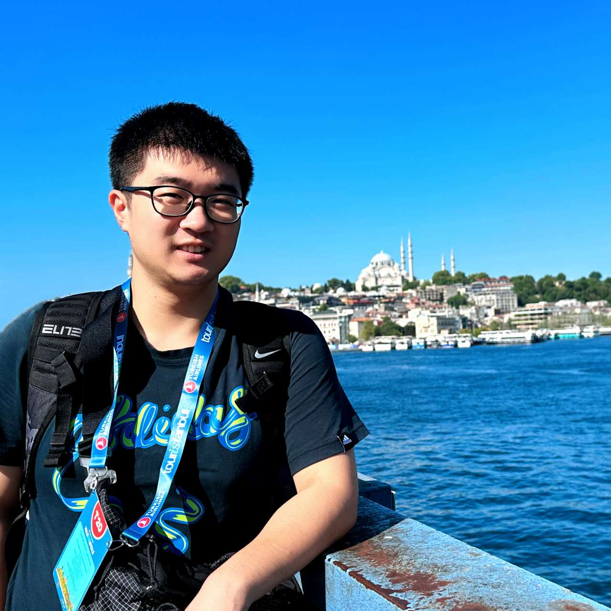

#### Phd Student

|||
|:-:|:-|
|  | **Yanran Liu**, Incoming PhD student in BMS (Sep 2026 - Now).   - **Contact**: `yanranliu7-c@my.cityu.edu.hk` [`Personal Page`](https://liuyanran666.github.io/)   - **Background**: M.Sc. in Information System at CityU.   - **Interest**: `Deep Learning`, `Gene Regulatory Network`, `Spatial Domains`, `Single-Cell/Spatial Multi-Omics`. |
|ENFP-A||

|||
|:-:|:-|
|    INFJ-A| **Anna Jiang**, PhD student in BMS (Sep 2025 - Now).   - **Contact**: `anna.jiang@my.cityu.edu.hk` [`Personal Page`](https://fanjiangchenghe.github.io/) [`CityU Scholar`](https://scholars.cityu.edu.hk/en/persons/anna-jiang/)   - **Background**: M.Sc. in CS at CityU.   - **Co-1st Author**: NAR\*1.   - **Co-Author**: AS\*1.   - **Interest**: `Deep Learning`, `Single-Cell/Spatial Multi-Omics`, `Mitochondrial Transfer`, `Copy Number Abberation`| 
|||

|||
|:-:|:-|
|    ESFJ-A| **Chengshang Lyu**, PhD student in BMS (Sep 2024 - Now).   - **Contact**: `cs.lyu@my.cityu.edu.hk` [`Personal Page`](https://me.lvcs.top/) [`CityU Scholar`](https://scholars.cityu.edu.hk/en/persons/chengshang-lyu/)   - **Background**: B.Eng. in Information Engineering at XJTU. M.Eng. in Bioinformatics at UCAS.   - **Co-Author**: NAR\*1.   - **Award**: *Best Poster Presentation of CityUHK BMS-SYSY BME Joint Research Gala 2025*. *CityuHK Research Tuition Scholarship 2024/25*. *BMS Postgraduate Research Output Award 2024/25*.   - **Interest**: `Dynamic Network Biomarker`, `Sample Specific Network`, `Gene Regulatory Network`, `Single-Cell/Spatial Multi-Omics`.| 
|| |

